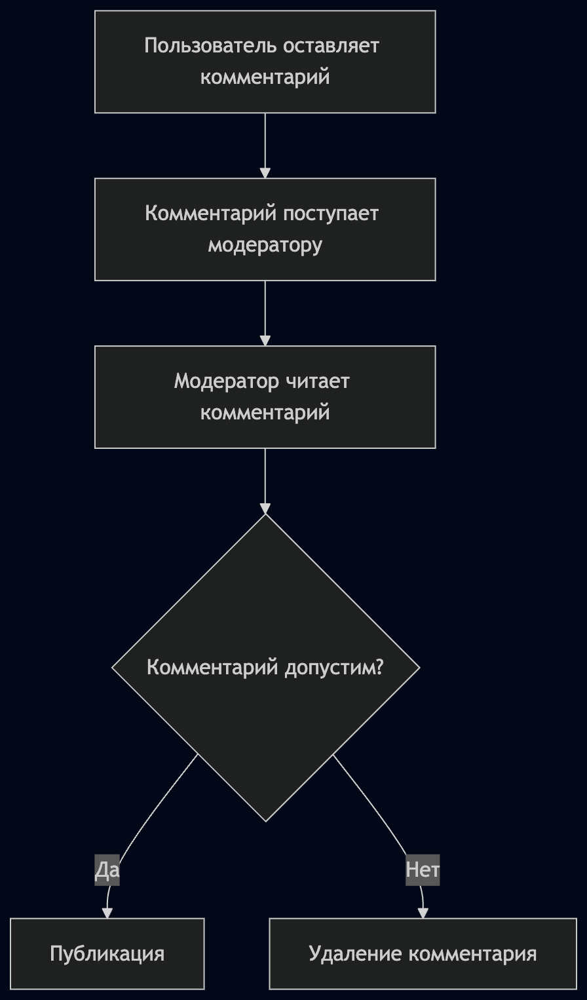
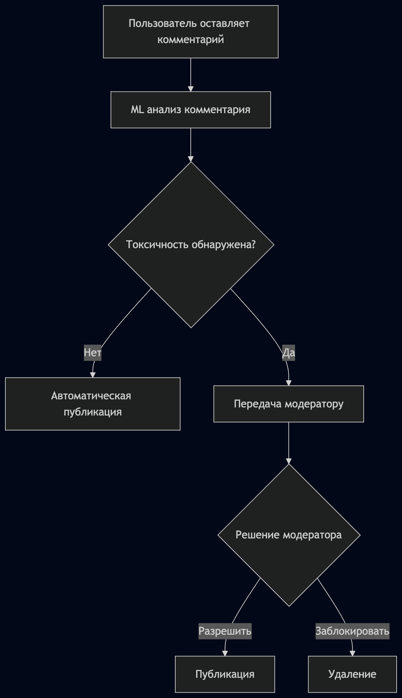
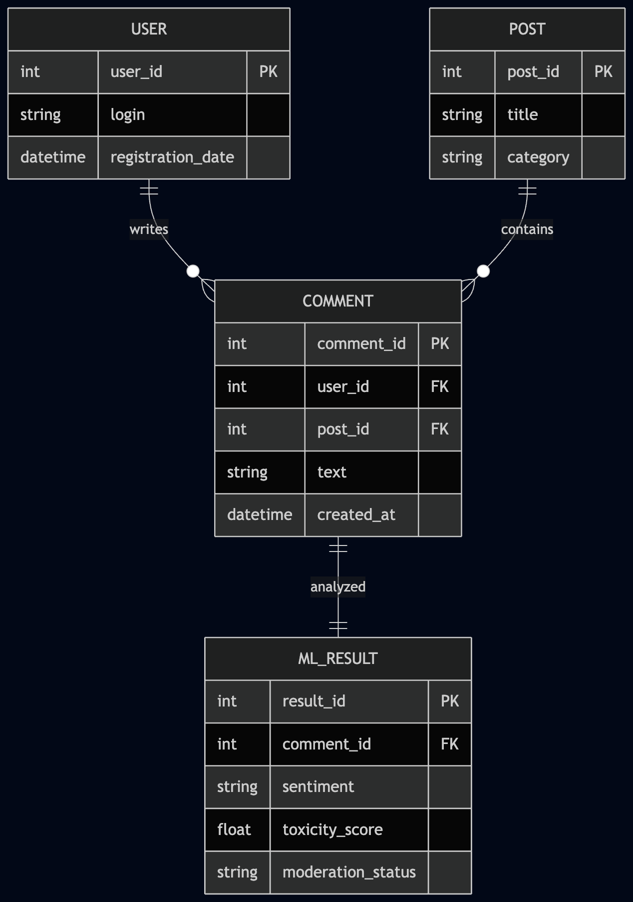
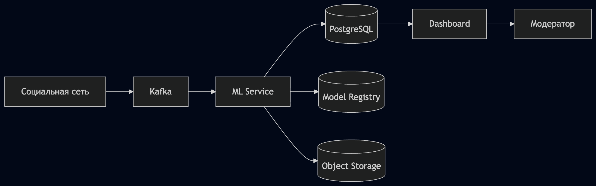
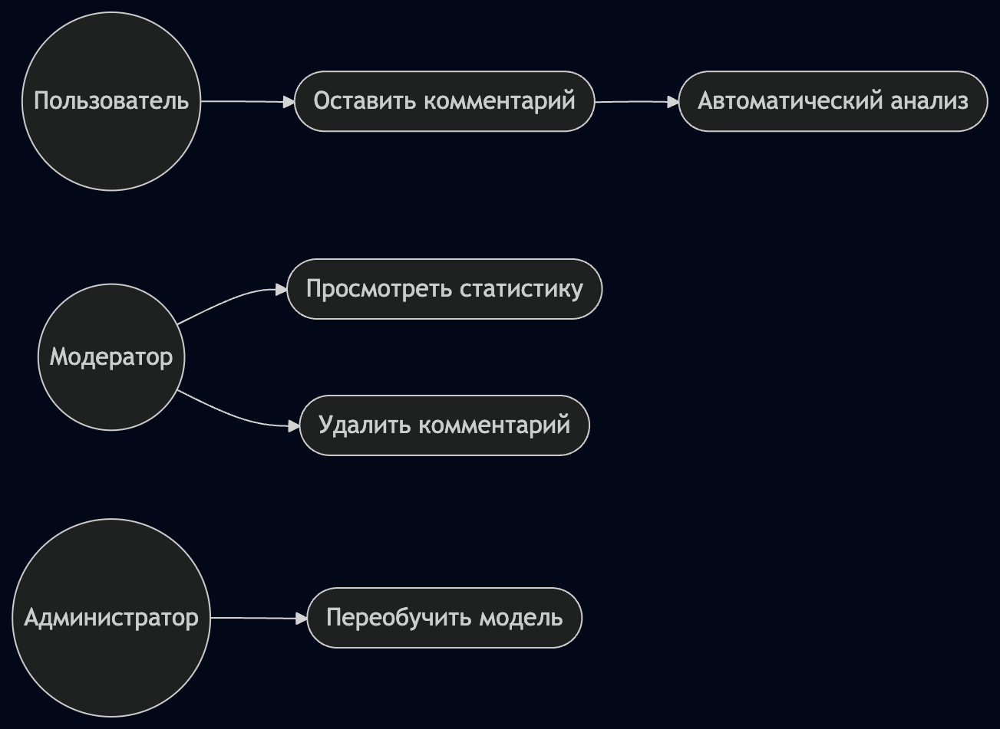
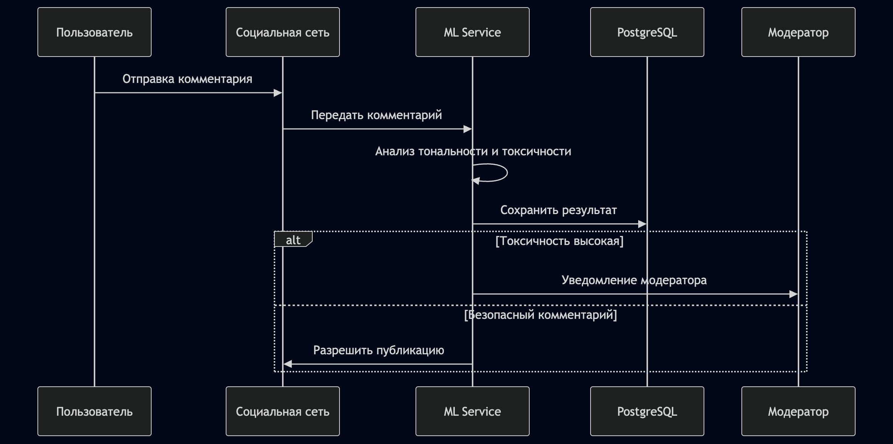

# Кейс №1. ML-система автоматического анализа пользовательских комментариев в социальной сети

## Состав команды

| Участник          | Роль                              |
| ----------------- | --------------------------------- |
| Машковцева Марина | Product Owner, Software Architect |
| Березина Софья    | Data Scientist, Data Architect    |

---

# 1. Описание проекта

## 1.1 Название проекта

Интеллектуальная система автоматического анализа пользовательских комментариев для поддержки модерации социальной сети.

## 1.2 Бизнес-проблема

Социальная сеть ежедневно получает до 500 000 комментариев пользователей. В настоящее время анализ комментариев выполняется вручную модераторами либо осуществляется выборочно.

Существующий процесс имеет ряд недостатков:

* высокая нагрузка на сотрудников модерации;
* длительное время обработки комментариев;
* субъективность оценки;
* высокий риск пропуска токсичного или запрещённого контента;
* вероятность штрафов и санкций со стороны контролирующих органов.

Для решения указанных проблем предлагается разработка системы анализа комментариев на основе технологий машинного обучения и обработки естественного языка (NLP).

---

# 2. Цели и предпосылки разработки

## 2.1 Цель проекта

Разработать информационную систему с использованием технологий машинного обучения для автоматического определения тональности комментариев и выявления потенциально опасного контента.

## 2.2 Ожидаемый бизнес-эффект

После внедрения системы предполагается:

* снижение нагрузки на модераторов не менее чем на 70%;
* сокращение времени реакции на негативные комментарии;
* повышение качества модерации;
* уменьшение риска штрафов и санкций;
* получение аналитики по реакции пользователей на контент.

## 2.3 Почему использование ML лучше текущего подхода

Текущий процесс основан на ручной проверке комментариев.

Недостатки:

* низкая скорость обработки;
* высокая стоимость;
* человеческий фактор;
* невозможность полного охвата всех комментариев.

Преимущества ML-подхода:

* автоматическая обработка больших объёмов данных;
* единообразие решений;
* работа в режиме реального времени;
* возможность масштабирования.

---

# 3. Бизнес-требования

## 3.1 Основные бизнес-требования

Система должна обеспечивать:

1. Автоматический анализ комментариев пользователей.
2. Выявление токсичных комментариев.
3. Определение тональности текста.
4. Приоритизацию комментариев для модерации.
5. Формирование аналитической отчётности.

## 3.2 Бизнес-ограничения

* соблюдение законодательства РФ;
* защита персональных данных пользователей;
* ограниченность вычислительных ресурсов;
* необходимость работы в режиме высокой нагрузки.

---

# 4. Функциональные и нефункциональные требования

## 4.1 Функциональные требования

Система должна:

* принимать комментарии из социальной сети;
* выполнять предварительную обработку текста;
* определять тональность комментария;
* рассчитывать уровень токсичности;
* сохранять результаты анализа;
* передавать опасные комментарии модераторам;
* предоставлять аналитические отчёты.

## 4.2 Нефункциональные требования

| Требование                  | Значение                      |
| --------------------------- | ----------------------------- |
| Доступность                 | 99.5%                         |
| Время обработки комментария | до 500 мс                     |
| Масштабируемость            | до 1 млн комментариев в сутки |
| Безопасность                | шифрование данных             |
| Надёжность                  | резервное копирование         |

---

# 5. Анализ текущего и целевого бизнес-процесса

## 5.1 Процесс AS-IS

Текущий процесс модерации:

1. Пользователь публикует комментарий.
2. Комментарий поступает модератору.
3. Модератор вручную анализирует текст.
4. Принимается решение о публикации либо удалении.

### Диаграмма AS-IS

## 5.2 Процесс TO-BE

После внедрения системы:

1. Пользователь публикует комментарий.
2. Комментарий автоматически анализируется ML-моделью.
3. Безопасные комментарии публикуются автоматически.
4. Потенциально опасные комментарии направляются модератору.

### Диаграмма TO-BE

## 5.3 Изменения бизнес-процесса

Основным изменением является перенос значительной части работы по анализу комментариев с человека на систему искусственного интеллекта.

---

# 6. Методология решения

## 6.1 Тип ML-задачи

Основной задачей является классификация текстов.

Используются следующие направления:

* анализ тональности (Sentiment Analysis);
* выявление токсичности (Toxicity Detection);
* обработка естественного языка (NLP).

## 6.2 Выбранный подход

Для анализа комментариев предлагается использовать трансформерную модель семейства BERT.

Возможные варианты:

* RuBERT;
* Russian RoBERTa;
* дообученная BERT-модель.

## 6.3 Логика работы модели

Вход:

Комментарий пользователя.

Выход:

* позитивный;
* нейтральный;
* негативный;
* токсичный.

---

# 7. Данные

## 7.1 Источники данных

Для работы модели необходимы следующие данные:

* текст комментария;
* информация о публикации;
* данные о пользователе;
* результаты предыдущих модераций;
* пользовательские жалобы.

## 7.2 Структура данных

Основные сущности:

### User

* user_id
* login
* registration_date

### Post

* post_id
* title
* category

### Comment

* comment_id
* user_id
* post_id
* text
* created_at

### ML_Result

* result_id
* comment_id
* sentiment
* toxicity_score
* moderation_status

## 7.3 Диаграмма данных

---

# 8. Метрики качества модели

## 8.1 Метрики машинного обучения

Для оценки модели используются:

* Accuracy;
* Precision;
* Recall;
* F1-score.

## 8.2 Приоритетные метрики

Особое внимание уделяется Recall для токсичных комментариев.

Причина:

Пропуск опасного комментария может привести к нарушениям законодательства и штрафам.

## 8.3 Связь с бизнесом

Рост Recall приводит к:

* уменьшению количества пропущенного токсичного контента;
* снижению риска санкций;
* повышению качества модерации.

---

# 9. Риски и способы их снижения

| Риск                             | Способ снижения                |
| -------------------------------- | ------------------------------ |
| Недостаток обучающих данных      | Дополнительная разметка        |
| Появление нового сленга          | Переобучение модели            |
| Сарказм и неоднозначность текста | Использование трансформеров    |
| Смещение данных                  | Регулярный мониторинг качества |
| Рост нагрузки                    | Горизонтальное масштабирование |

---

# 10. Подготовка пилота

## 10.1 Цель пилота

Проверить способность системы автоматически выявлять токсичные комментарии.

## 10.2 Набор данных

Используется исторический набор данных из 50 000 комментариев.

Разделение:

* 70% обучение;
* 15% валидация;
* 15% тестирование.

## 10.3 Оценка пилота

Пилот считается успешным при выполнении следующих условий:

* Recall > 90%;
* Precision > 85%;
* сокращение нагрузки на модераторов не менее чем на 70%.

---

# 11. MVP и технический долг

## 11.1 Состав MVP

В первую версию входят:

* анализ тональности;
* выявление токсичности;
* интерфейс модератора;
* хранение результатов анализа.

## 11.2 Технический долг

Для последующих версий остаются:

* поддержка нескольких языков;
* анализ изображений;
* анализ видео;
* распознавание сарказма;
* автоматическое переобучение модели.

---

# 12. Архитектура решения

## 12.1 Общая архитектура

Система состоит из следующих компонентов:

1. Социальная сеть.
2. Сервис приёма комментариев.
3. Очередь сообщений.
4. ML-сервис.
5. База данных.
6. Панель модератора.
7. Система аналитики.

### Архитектурная диаграмма

## 12.2 Причины распределённого хранения данных

Используется распределённое хранение:

### PostgreSQL

Хранение структурированных данных.

### Object Storage

Хранение архивов комментариев.

### Model Registry

Хранение версий ML-моделей.

Такой подход обеспечивает:

* отказоустойчивость;
* масштабируемость;
* независимость компонентов.

---

# 13. UML-модели

## 13.1 Диаграмма прецедентов

Основные акторы:

* Пользователь;
* Модератор;
* Администратор.

Основные прецеденты:

* публикация комментария;
* анализ комментария;
* просмотр отчётов;
* удаление комментария;
* управление моделью.

## 13.2 Диаграмма последовательности

Сценарий обработки комментария:

1. Пользователь отправляет комментарий.
2. Система получает комментарий.
3. ML-модель выполняет анализ.
4. Результат сохраняется.
5. Модератор получает уведомление при необходимости.

---

# 14. Production-система

## 14.1 Инфраструктура

Предлагаемый стек:

* Python;
* FastAPI;
* PostgreSQL;
* Kafka;
* Docker;
* Kubernetes.

## 14.2 Масштабируемость

Система масштабируется за счёт:

* увеличения количества ML-сервисов;
* распределения нагрузки через Kubernetes;
* использования очередей сообщений.

## 14.3 Требования к работе системы

| Показатель           | Значение            |
| -------------------- | ------------------- |
| SLA                  | 99.5%               |
| RPS                  | до 100 запросов/сек |
| Latency              | до 500 мс           |
| Время восстановления | до 30 минут         |

## 14.4 Возможные риски эксплуатации

* рост количества комментариев;
* деградация качества модели;
* отказ компонентов инфраструктуры;
* изменения законодательства.

Для минимизации рисков предусматриваются мониторинг, резервирование и регулярное переобучение модели.

---

# 15. Заключение

Разработанная ML-система позволит автоматизировать процесс анализа комментариев пользователей социальной сети, значительно снизить нагрузку на модераторов и повысить качество контроля контента.

Использование современных методов машинного обучения и NLP позволит обрабатывать большие объёмы данных в режиме реального времени, обеспечивая соблюдение требований законодательства и повышение качества пользовательского опыта.
